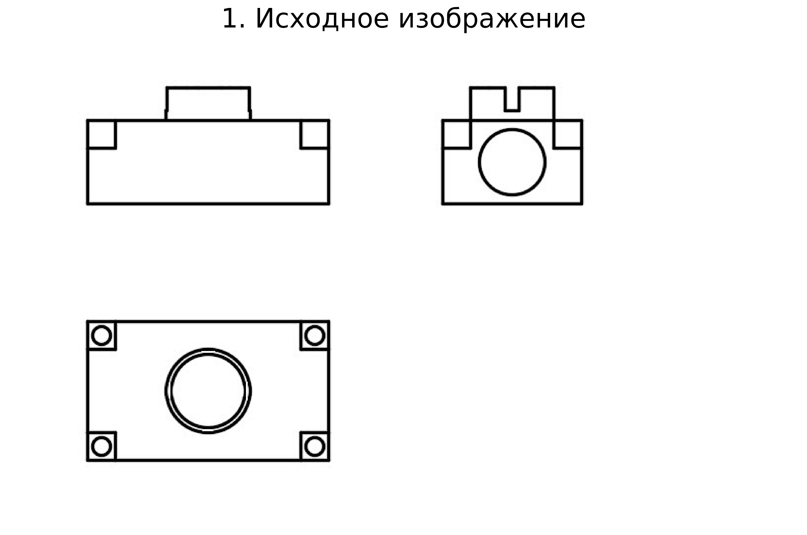
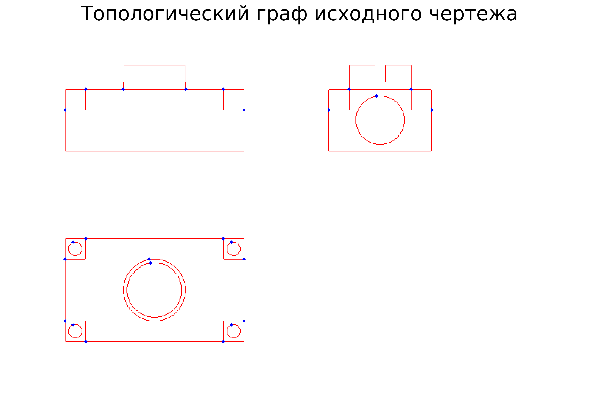
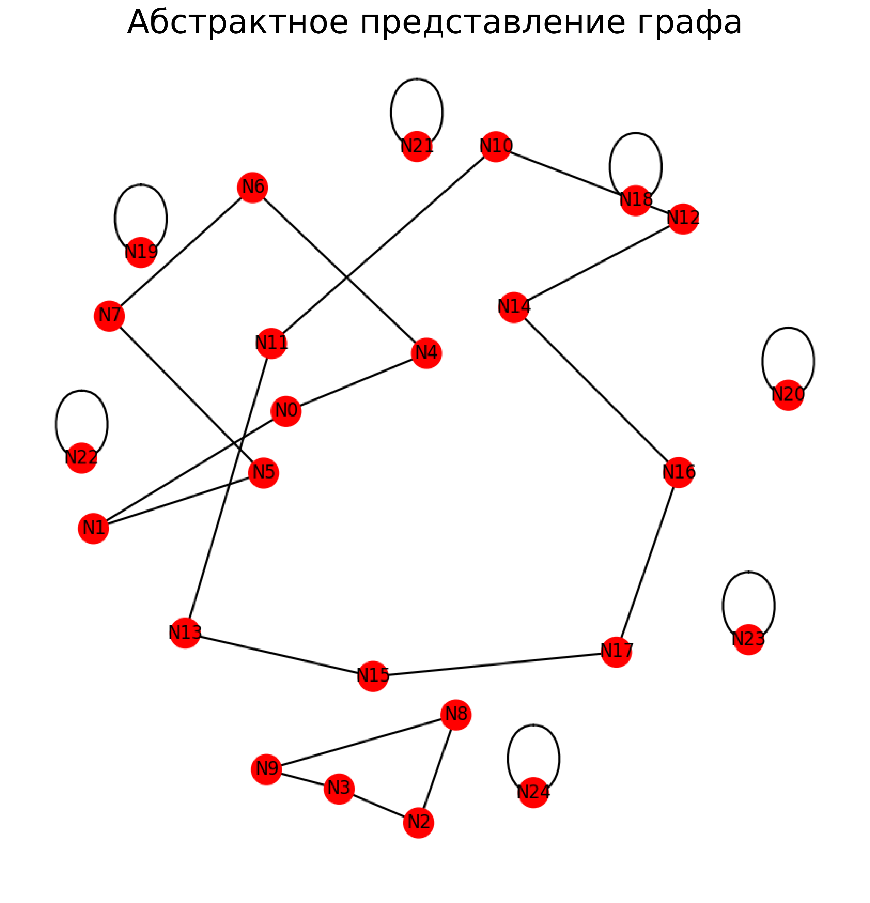
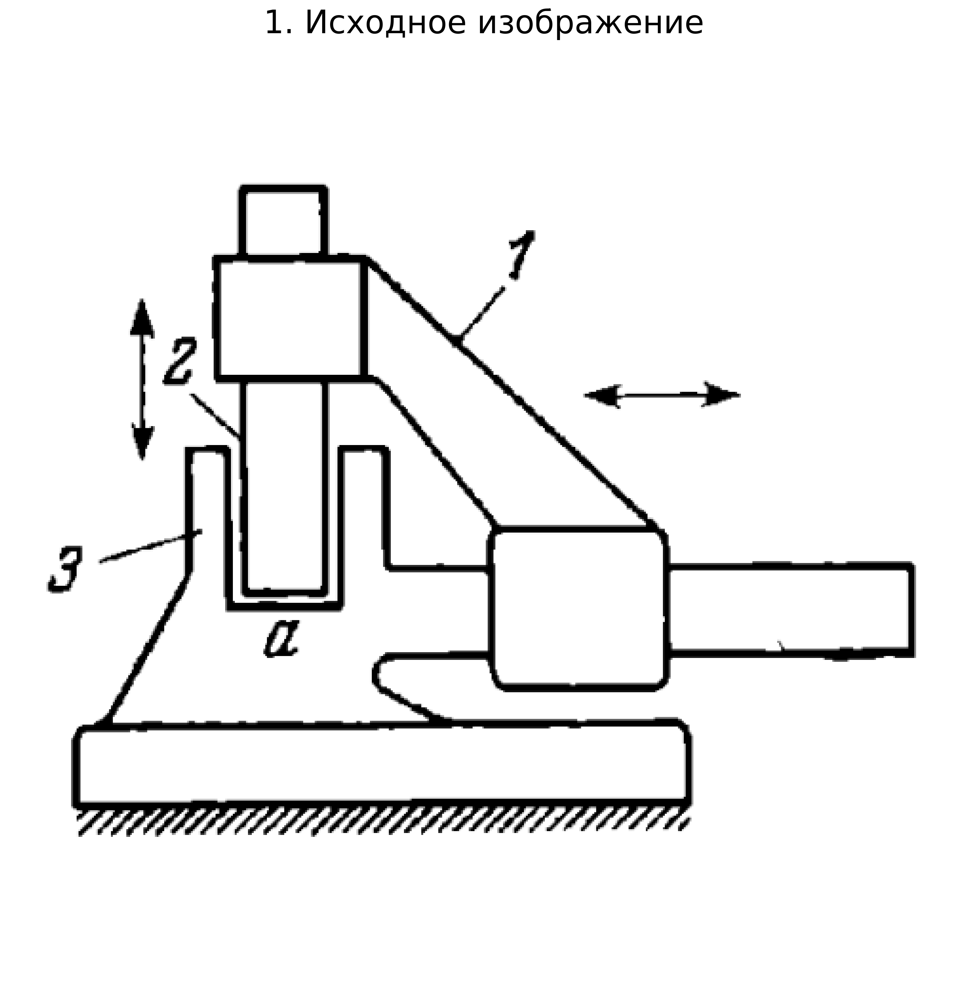
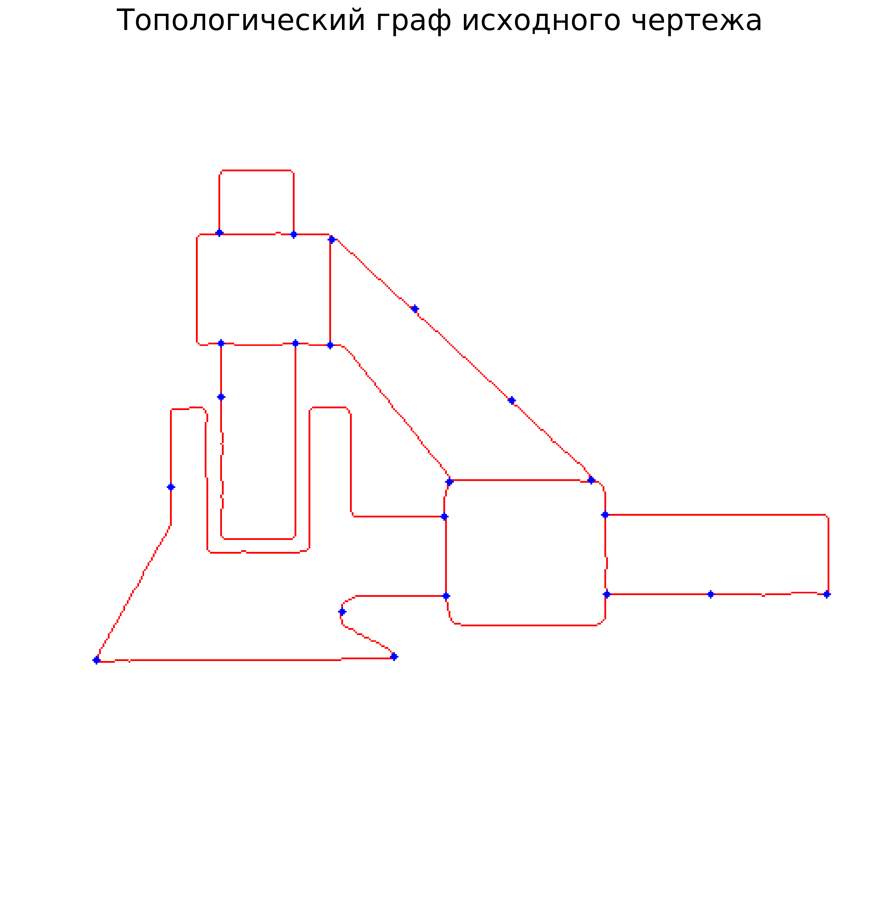
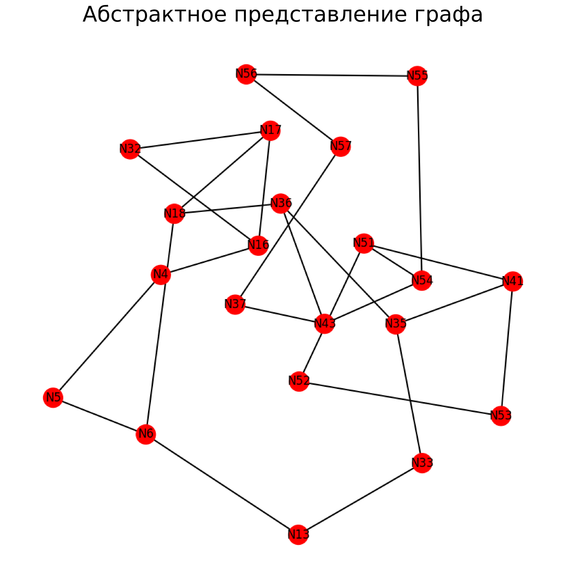
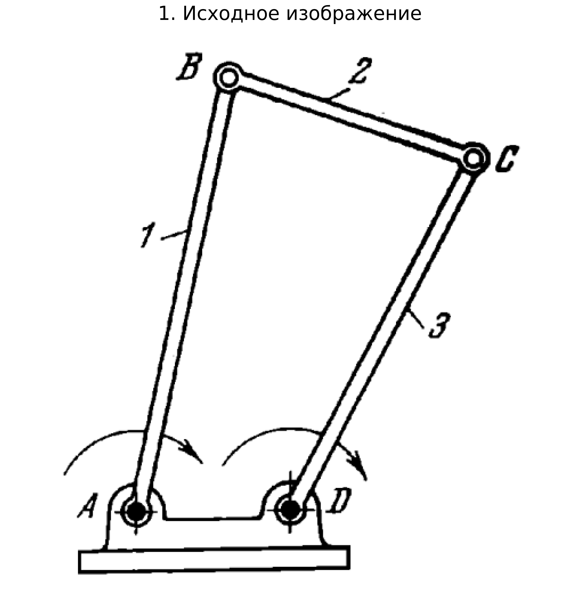
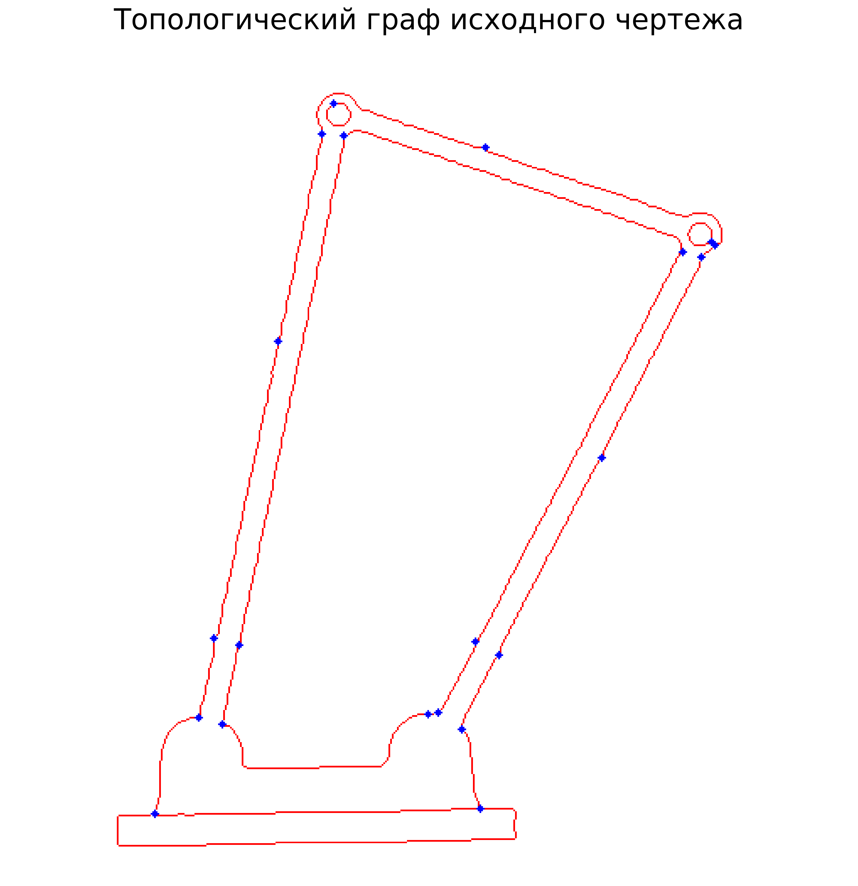
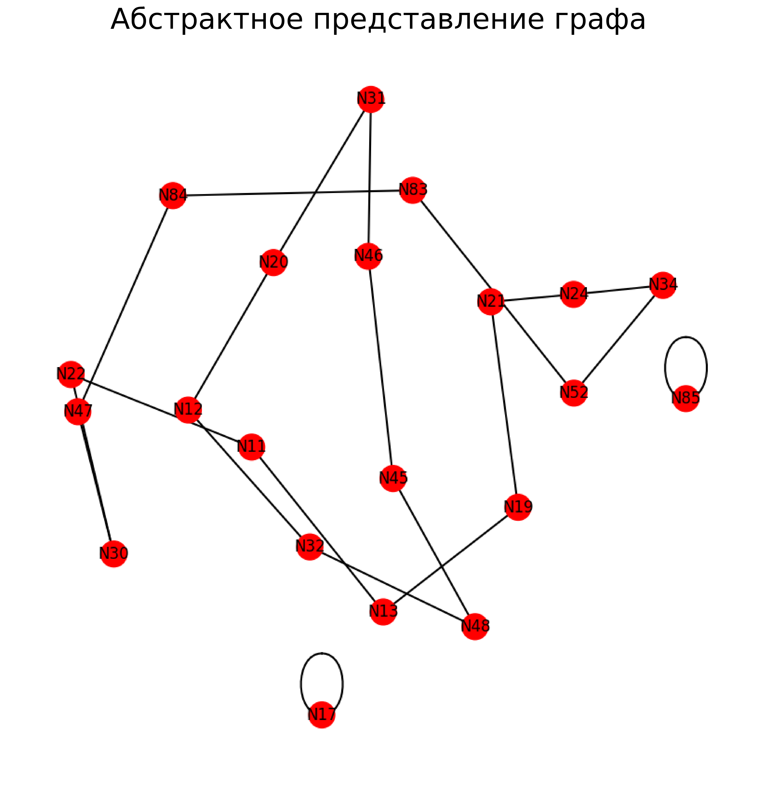

# Анализ технических 2D-документов с интеграцией геометрических характеристик

**Метод анализа технических документов (2D-объекты), интегрирующего соотношения, размеры и пропорции деталей объектов, для улучшения их обработки предметно-ориентированными агентами**  

---

## Описание проекта

Данный проект представляет собой пайплайн для автоматического анализа технических чертежей и 2D-документов с извлечением геометрических характеристик объектов. Система обрабатывает изображения чертежей, выделяет детали, анализирует их размеры, пропорции и взаимное расположение, формируя структурированное представление в формате JSON.

### Основные возможности метода

- Автоматическое распознавание геометрических примитивов на растровых чертежах
- Извлечение размеров и пропорций деталей
- Анализ пространственных соотношений между элементами
- Формирование структурированных данных в формате JSON
- Визуализация результатов обработки
- Подготовка данных для предметно-ориентированных агентов

---

## Структура проекта
``` 
2D_draw_project/
├── README.md                       # Документация проекта
├── Data/
│   ├── Raw/                        # Входные изображения чертежей
│   └── Processed/                  # Обработанные результаты
│       └── [image_name]/           # Папка для каждого чертежа
├── Examples/                       # Папка с примерами
│   ├── Input/                      # Пример изображений на вход
│   └── Output/                     # Пример выходных изображений графа
├── Notebooks/                      # Jupyter-ноутбуки
│   └── 2D_draw_pipeline.ipynb      # Основной пайплайн обработки
├── Output/                         # JSON-файлы результатов
└── venv/                           # Виртуальное окружение Python
```

---

### Требования

- Python 3.8+
- Jupyter Notebook

### Использование

1. **Подготовка данных:**
   - Разместите исходные изображения чертежей в папке `Data/Raw/`
   - Поддерживаемые форматы: PNG, JPG, JPEG

2. **Запуск пайплайна:**
    Откройте ноутбук:
```bash
   jupyter notebook Notebooks/2D_draw_pipeline.ipynb
```

3. **Выполнение пайплайна:**

    *Блок 1 - определение пайплайна:*
    
    Содержит функцию
 ```python
    def run_pipeline(image_path):
``` 
   Внутри реализованы этапы:
   - Загрузка и предобработка изображений
   - Извлечение геометрических характеристик
   - Анализ соотношений и пропорций
   - Формирование JSON-представления
   - Сохранение результатов

   *Блок 2 - пакетная обработка изображений:*

   Данный блок автоматически проходит по всем изображениям в паке Data/Raw и применяет к каждому полный пайплайн

4. **Результаты:**
   - Обработанные изображения: `Data/Processed/[image_name]/`
   - JSON-файлы: `Results/[image_name].json`

---

## Формат выходных данных

Результаты работы пайплайна представлены в виде иерархической графовой структуры, описывающей геометрию, метрики и семантику 2D-чертежа.

Выходные данные имеют следующую структуру:

```json
{
  "metadata": {...},
  "topology": {
    "nodes": [...],
    "edges": [...]
  },
  "kinematics_and_metrics": [...],
  "ontology": {
    "classes": {...},
    "entities": {
      "nodes": [...],
      "line_segments": [...],
      "angles": [...],
      "ratios": [...]
    }
  }
}
```

1. **Метаданные(metadata)**

Содержат информацию об изображении и задаче анализа:

Поля:
- идентификатор изображения
- описание задачи
- дополнительные служебные параметры (при наличии)


2. **Топологический слой (topology)**

Представляет чертёж в виде графа:

 Узлы (nodes)

Множество вершин графа, соответствующих:
- точкам соединений
- конечным точкам линий

Каждый узел содержит:
- уникальный идентификатор
- тип (например: соединение / конец)
- координаты в изображении

Рёбра (edges)

Связывают пары узлов и описывают геометрию соединений.

Каждое ребро содержит:
- идентификаторы начального и конечного узла
- длину (в пикселях)

- 

3. **Метрический слой (kinematics_and_metrics)**

Содержит локальные геометрические характеристики узлов графа.

Каждый элемент описывает:
- центральный узел (joint)
- связанные с ним элементы графа
- длины соответствующих сегментов
- отношение длин (пропорции)
- угловые характеристики соединений


4. **Онтологический слой (ontology)**

Описывает семантическую интерпретацию графа.

4.1 Классы (classes)

Определяют иерархию сущностей модели:
- Node (базовый класс)
- Joint (соединение)
- EndPoint (концевая точка)
- LineSegment (отрезок)
- Angle (угол)
- LengthRatio (отношение длин)

4.2 Экземпляры (entities)

Фактические объекты, извлечённые из изображения.

*Nodes*

Представляют узлы графа с координатами и типом.

*LineSegments*

Представляют рёбра графа между узлами и их длину.

*Angles*

Описывают угловые отношения между рёбрами в узле и могут содержать семантическую классификацию.

*LengthRatios*

Описывают отношения длин между соединёнными элементами.

---

## 📸 Пример работы пайплайна

### Пример №1

*Входное изображение*



*Топологический граф*



*Абстрактное представление*



### Пример №2

*Входное изображение*



*Топологический граф*



*Абстрактное представление*



### Пример №3

*Входное изображение*



*Топологический граф*



*Абстрактное представление*




---

## Применение

Результаты работы пайплайна могут использоваться для:

- **Контроль качества** — проверка соответствия стандартам
- **Обучение нейросетей** — подготовка датасетов
- **Предметно-ориентированные агенты** — анализ чертежей
- **Архивация документации** — создание структурированных баз данных

---

## Контакты

email: asamson553@gmail.com | 
Phone: +7-953-901-95-53 | 
Telegram: @anthlyy
